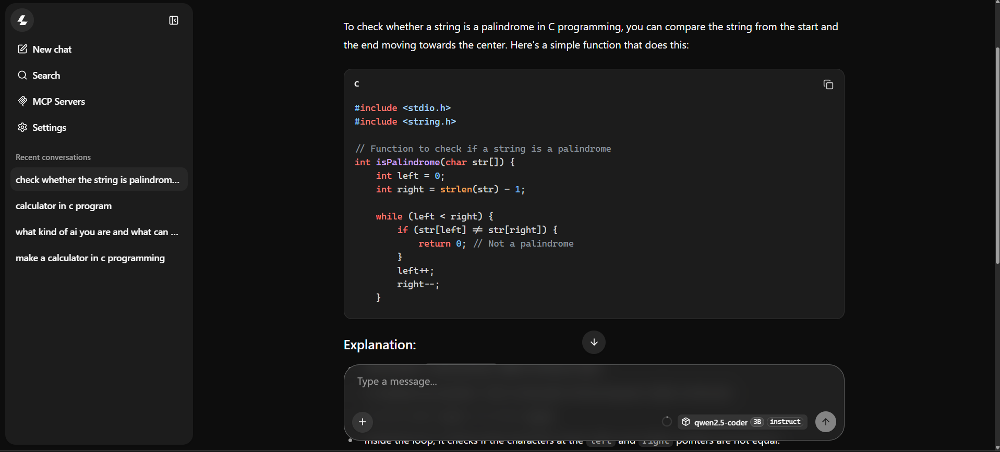
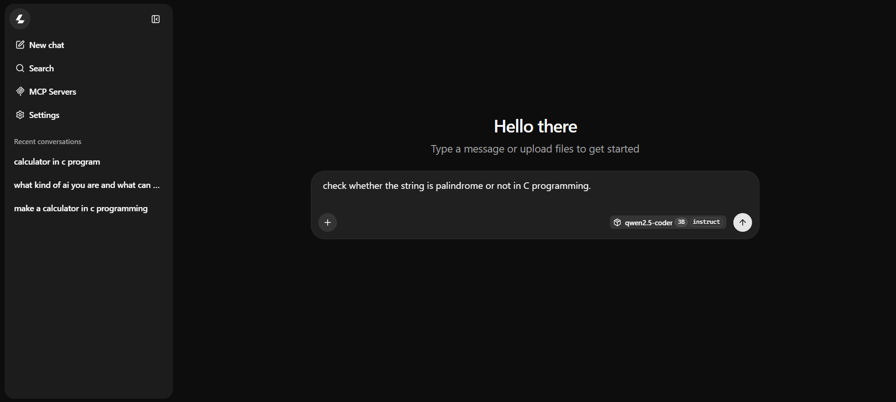

# 🖥️ PenDrive AI — Offline Coding Assistant

A fully offline, portable AI assistant that runs straight from a USB pendrive — no internet, no install, no cloud. Plug it into any Windows PC and get a local coding assistant tuned for **programming, DSA (Data Structures & Algorithms), and Computer Science** problems.

Built for students, competitive programmers, and anyone who wants a private, no-subscription coding buddy that works even without Wi-Fi — during exams, in labs, or on the go.

---

## 📥 Download

> ### 👉 **[Download PenDrive AI (.zip, ~2.2GB) — Google Drive](https://drive.google.com/file/d/1bioh5Mx6_B3T2em9a9E8Lo86BZV8TFVZ/view?usp=drivesdk)**
>
> GitHub doesn't allow files this large, so the full package (llamafile + model + launcher) is hosted on Google Drive instead.

---

## ✨ Why this exists

- 📴 **100% offline** — no API keys, no internet, no data leaves your machine
- 💻 **Runs from a pendrive** — no installation on the host PC required
- 🧠 **Tuned for coding & DSA** — ships with Qwen2.5-Coder-3B-Instruct, a model specialized for programming tasks, code explanation, debugging, and algorithmic problem-solving
- 🔁 **Swappable** — don't like the default model? Drop in any GGUF model of your choice
- 🆓 **Free & open** — built entirely on open-source tools (llamafile + open-weight models)

---

## 📦 What's inside the ZIP

```
PenDriveAI.zip
├── llamafile.exe              # The inference engine (runs the AI model)
├── qwen2.5-coder-3b-instruct-q4_k_m.gguf   # The AI model (coding-focused)
└── start.bat                  # One-click launcher
```

**Minimum requirements:**
- An 8GB (or larger) USB pendrive
- Windows 10/11 PC (any recent CPU — Ryzen 5 / i5 class or better recommended)
- At least 8GB system RAM on the host PC (16GB recommended for smoother performance)
- USB 3.0 port recommended (USB 2.0 works, just slower to load)

---

## 🚀 Quick Start

1. **[Download the ZIP from Google Drive](https://drive.google.com/file/d/1bioh5Mx6_B3T2em9a9E8Lo86BZV8TFVZ/view?usp=drivesdk)** (~2.2GB)
2. **Get the files onto your pendrive** — either works:
   - **Option A:** Extract the ZIP directly onto your pendrive (right-click the ZIP → Extract All → choose your pendrive drive as the destination)
   - **Option B:** Extract the ZIP anywhere on your PC first, then copy-paste the three extracted files (`llamafile.exe`, the `.gguf` model, and `start.bat`) onto your pendrive
   
   > ⚠️ Format your pendrive as **NTFS or exFAT**, not FAT32 — FAT32 can't hold files over 4GB, and the ZIP/model are close to or over that.
3. **Double-click `start.bat`** (on the pendrive)
4. Wait for the terminal to show:
   ```
   main: server is listening on http://127.0.0.1:8080
   ```
   (First load can take 30 seconds to a few minutes depending on your pendrive's read speed — this is normal, don't close the window.)
5. Open your browser and go to **http://127.0.0.1:8080**
6. Start chatting with your offline coding assistant! 🎉

---

## 📸 Screenshots

<!--
Add your screenshots to a folder named "screenshots" in the repo, then reference them below.
Example:


-->

| Terminal after launch | Chat interface |
|---|---|
|  |  |

*(Replace the image paths above with your actual screenshot files once uploaded to a `/screenshots` folder in this repo.)*

---

## 🔄 Using a different AI model

Want a bigger, smaller, or different model? Easy:

1. Download any `.gguf` model of your choice from [Hugging Face](https://huggingface.co/models?library=gguf)
2. Copy the new `.gguf` file into the pendrive folder
3. Open `start.bat` in a text editor (right-click → Edit) and update the filename:
   ```bat
   .\llamafile.exe --server --model "your-new-model-name.gguf" -ngl 0
   ```
4. Rename `start.bat` to whatever you like (e.g. `start-mymodel.bat`) if you want to keep multiple models side by side
5. Save, then double-click to launch

> 💡 Tip: Stick to **Q4_K_M quantized GGUF models** for the best balance of speed and accuracy on CPU-only laptops. Avoid going below Q4 — it noticeably hurts coding/logic accuracy.

---

## ⚙️ Customizing start.bat

The default launch command:

```bat
.\llamafile.exe --server --model "qwen2.5-coder-3b-instruct-q4_k_m.gguf" -ngl 0
```

Useful flags you can add:

| Flag | What it does |
|------|--------------|
| `--ctx-size 4096` | Sets context window size (how much text the AI can "remember" per conversation) |
| `-ngl 0` | Forces CPU-only mode (recommended for laptops without a dedicated GPU) |
| `--threads N` | Set N to your CPU's physical core count for best speed (e.g. `--threads 6` for a 6-core CPU) |
| `-ngl 999` | Offload all layers to GPU (only if you have a dedicated NVIDIA/AMD GPU with enough VRAM) |

---

## 🛠️ Troubleshooting

**Terminal seems stuck on "loading model"**
- This is often just slow disk read — a multi-GB file on a USB pendrive can take a few minutes. Check Task Manager → Performance tab; if Disk or RAM usage is active, it's still working.

**It's been stuck for 5+ minutes with zero activity**
- Check your free RAM — you need at least the model's file size in free RAM (e.g. ~2GB free for the 3B model).
- Verify the `.gguf` file isn't corrupted — if the ZIP download from Google Drive got interrupted, re-download it.

**"No usable GPU found" warning**
- Harmless if you're running CPU-only (`-ngl 0`). This just confirms it's using your CPU, not a GPU.

**Responses are too slow**
- Switch to a smaller model (e.g. a 1.5B variant) or reduce `--ctx-size`.

**Browser can't connect to localhost:8080**
- Make sure the terminal window is still open and shows "server is listening" — closing it stops the AI server.

**Google Drive says "can't scan for viruses" or shows a warning**
- Normal for large files — just click "Download anyway."

---

## 📚 About the default model

**Qwen2.5-Coder-3B-Instruct** is a code-specialized open-weight model from Alibaba's Qwen team, fine-tuned specifically for programming tasks — code generation, debugging, explanation, and algorithmic reasoning. It punches above its size class on coding benchmarks compared to general-purpose models of similar size, making it a solid fit for B.Tech CS coursework, DSA practice, and quick coding help — all without needing a GPU.

---

## ⚠️ Disclaimer

Like all AI models, responses can occasionally be wrong — especially on harder algorithmic edge cases. Always verify and test code before submitting for coursework or assignments. This tool is meant to assist learning, not replace understanding the fundamentals.

---

## 📄 License

This project (scripts/config) is open for anyone to use, modify, and share. The AI model and inference engine are separately licensed by their original creators:
- [llamafile](https://github.com/Mozilla-Ocho/llamafile) — Apache 2.0
- [Qwen2.5-Coder](https://huggingface.co/Qwen) — Apache 2.0

---

### ⭐ If this helped you, consider starring the repo!
